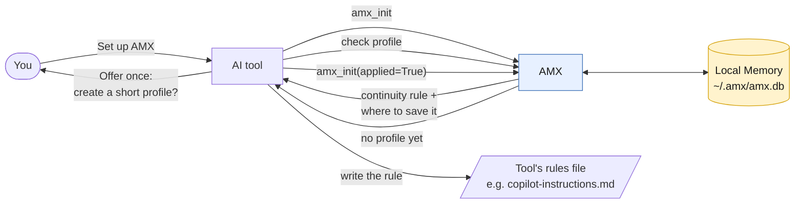
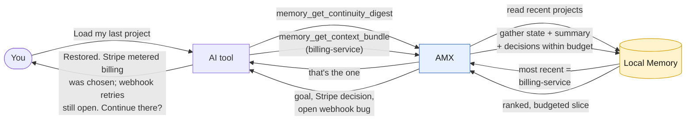
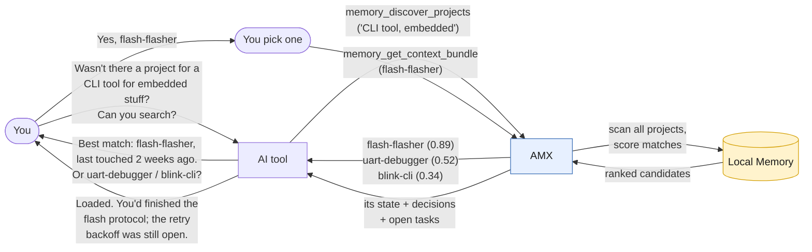
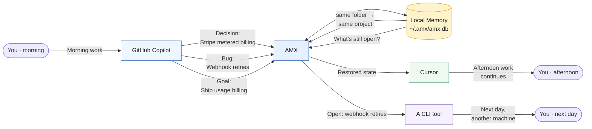

# AMX — Agent Memory Exchange

**Your AI tools share one memory, so you never have to re-explain your project when you switch between them.**

[](LICENSE)


## What is AMX?

AMX gives your AI coding tools a shared memory. Work on a project in GitHub Copilot, then open Cursor or a terminal the next day — and your assistant already knows what the project is, what you decided, and what's left to do.

It solves a straightforward problem: every AI tool forgets everything when you close the chat or switch tools. Today you fix that by re-explaining yourself or pasting old chat logs. AMX stores small, structured notes — decisions, tasks, the current goal — in one local file, and any connected tool reads that at the start of a session.

It runs entirely on your machine. No account, no cloud, no setup beyond installing it. Optionally, you can connect it to Azure AI Search (Foundry IQ) for grounded retrieval alongside local memory; if that connection is absent or offline, AMX falls back to local search automatically.

## Requirements

**To run AMX:**
- **Python 3.10 or newer** (`python --version` to check)
- **pip** (ships with Python)

**To install it** — one of these (the installer detects and offers them; default pipx):
- **[pipx](https://pipx.pypa.io)** *(recommended)* — isolated install, works on externally-managed Pythons. Get it with `python3 -m pip install --user pipx`, `sudo apt install pipx`, or `brew install pipx`.
- **the `venv` module** *(no pipx needed)* — bundled with Python on most systems; Debian/Ubuntu may need `sudo apt install python3-venv`.

**Also useful:**
- **Git** — needed to install straight from the repo (`git+https://…`) and helps AMX recognize the same project across tools.

Python dependencies (`mcp`, `pydantic`) install automatically — you don't add anything by hand. AMX is **not on PyPI**, so never `pip install amx`; install from the repo as shown below.

## Installation

### Option 1: Let your AI assistant do it (recommended)

Paste this into GitHub Copilot, Cursor, or any AI assistant. It works whether or not you've cloned this repo — the assistant figures out which case it's in:

```text
Set up AMX for me.

First check whether this repository is already in my current directory
(look for a docs/llm_guide.md or pyproject.toml with name = "amx"):

- If it IS here, read the local docs/llm_guide.md and follow it to install AMX from
  this checkout, register it with this client, and walk me through setup.
- If it is NOT here, detect my operating system (Linux, macOS, or Windows),
  then fetch the guide from
  https://raw.githubusercontent.com/Mr-T-443/Agent-Memory-Exchange/main/docs/llm_guide.md
  and follow it to install and configure AMX for my OS.

The same guide also covers updating and uninstalling — use it for those later.
```

Your assistant reads [`docs/llm_guide.md`](docs/llm_guide.md) — locally if you have the repo, or over HTTP if you don't — and handles install, registration, and setup.

### Option 2: Manual Installation

Run the install script for your operating system:

**Linux / macOS:**
```bash
curl -fsSL https://raw.githubusercontent.com/Mr-T-443/Agent-Memory-Exchange/main/scripts/install.sh | sh
```

**Windows (PowerShell):**
```powershell
irm https://raw.githubusercontent.com/Mr-T-443/Agent-Memory-Exchange/main/scripts/install.ps1 | iex
```

Or, install straight from the repository using [`pipx`](https://pipx.pypa.io):
```bash
pipx install git+https://github.com/Mr-T-443/Agent-Memory-Exchange.git
```

**Don't have pipx and don't want it?** Use a plain virtualenv:
```bash
python3 -m venv ~/.amx                                                    # Windows: py -m venv %USERPROFILE%\.amx
~/.amx/bin/pip install git+https://github.com/Mr-T-443/Agent-Memory-Exchange.git
~/.amx/bin/amx install-mcp --all                                         # registers AMX with your AI tools
```

**From a local copy of this repo (any OS):**
```bash
pipx install .        # or, in a virtualenv: python3 -m venv .venv && .venv/bin/pip install .
```

Then check it worked:

```bash
amx info        # shows the version and where your memory is stored
```

Register AMX with your AI tools:

```bash
amx install-mcp --list              # see which clients are detected
amx install-mcp --all               # register AMX in all detected clients
amx install-mcp --client cursor     # or pick specific ones
amx install-mcp --remove --all      # cleanly unregister from every client
```

**Auto-configured clients** — `install-mcp` detects each of these and writes the right config:

| Client | Config it writes |
|---|---|
| Claude Code | `~/.claude.json` |
| Claude Desktop | `claude_desktop_config.json` |
| Cursor | `~/.cursor/mcp.json` |
| Windsurf | `~/.codeium/windsurf/mcp_config.json` |
| Antigravity | `~/.gemini/config/mcp_config.json` |
| VS Code (GitHub Copilot) | `<Code>/User/mcp.json` |
| Codex (CLI / Desktop) | `~/.codex/config.toml` |
| Gemini CLI | `~/.gemini/settings.json` |
| opencode | `~/.config/opencode/opencode.json` |
| GitHub Copilot CLI | `~/.copilot/mcp-config.json` |

For any other MCP-speaking tool, see [docs/WORKING.md](docs/WORKING.md#client-setup) — AMX works with any client that supports MCP. Once connected, tell your assistant **"set up AMX"** and it takes care of the rest.

**Update:** `amx update` (your memory is kept).  
**Uninstall:** `amx uninstall` (asks before deleting your memory).

## Quick Start

Once AMX is set up, you just talk to your AI assistant normally. A few examples:

**Set yourself up**

> **You:** Set up AMX.  
> **AI:** Done — I've turned on AMX memory for this tool. From now on I'll remember your projects and pick up where we left off.

**See what you've been working on**

> **You:** What projects have I been working on lately?  
> **AI:** You have three recent projects: *billing-service* (active yesterday), *router-firmware* (last week), and *blog-rewrite*. Want me to open one?

**Find something you half-remember**

> **You:** I was building some browser extension a while back — I forget the name.  
> **AI:** That's likely *tab-tamer*, last touched three weeks ago. Want me to load it?

**Pick up where you left off**

> **You:** Pick up where I left off on the billing service.  
> **AI:** Last session you chose Stripe metered billing and were mid-way through proration logic. Still open: webhook retries aren't handled yet. Want to start there?

**Continue a previous chat**

> **You:** Continue what we did in our last chat.  
> **AI:** We were debugging the OTA update flow — it hangs on Windows when the pipe closes. You were about to add a timeout. Shall I?

You never call a tool by hand — you just describe what you want.

### How it works, visually

Each flow reads left-to-right: **you** talk to an **AI tool**, the AI tool calls **AMX** over MCP, and AMX reads or writes the single local **database** (`~/.amx/amx.db`).

**Setting up AMX (`amx_init`)**



**Loading your last project**



**Finding a half-remembered project**



**Working across multiple AI tools**



## Working Across Multiple AI Tools

This is what AMX is for. You're deep in a session, the context limit hits, and you have to start fresh — in the same tool or a different one. Without AMX, you lose everything. With AMX, you just pick up where you left off.

**GitHub Copilot, mid-session.** You've been working for a few hours. Copilot hits its context limit.

> **Copilot:** I'm approaching my context limit. Before we continue, let me save our progress to AMX.  
> *(records the current goal, the Stripe decision, and the open webhook bug)*  
> Start a new chat and say "load this project from AMX" to continue.

**New chat — same tool, or switch to Cursor.** Doesn't matter which.

> **You:** Load this project from AMX and keep going.  
> **AI:** Restored. Goal: ship usage-based invoicing. You chose Stripe metered billing — proration logic is in progress. Still open: webhook retries aren't handled. Continuing from there.

**Next day — a terminal AI on another machine.**

> **You:** What's still open on the billing service?  
> **AI:** One thing: webhook retries aren't handled. Everything else is done.

The context limit stops being a problem. The thread follows you wherever you continue.

## How It Works

AMX stores small, structured notes about your project — decisions, tasks, the current goal — in one local file. When you start a session, your AI asks AMX for just the relevant slice and gets a short, ranked summary instead of a wall of old chat history.

For example, instead of replaying a 2-hour conversation, your assistant receives:

> Goal: ship usage-based invoicing. Decided: use Stripe metered billing. Open: webhook retries unhandled.

A few sentences of exactly what matters — not the whole transcript.

## Why AMX Exists

When you work across more than one AI tool, you spend time re-explaining yourself:

1. Monday — you design a feature in GitHub Copilot and settle on an approach.
2. Wednesday — you switch to Cursor, which knows none of it.
3. You spend ten minutes re-explaining, or paste yesterday's chat and burn tokens on noise.
4. Weeks or Months latter, on a AI App, you've forgotten the project name.

AMX removes each of those friction points. Your decisions and progress live in one place that every tool can read.

## Optional: Foundry IQ (Azure AI Search)

Add grounded retrieval from an Azure AI Search index alongside your local memory. AMX works without it — this is purely additive.

Put your keys in `~/.amx/.env` (AMX loads it automatically, no shell setup needed):

```bash
AMX_FOUNDRY_IQ_ENDPOINT=https://<your-service>.search.windows.net
AMX_FOUNDRY_IQ_API_KEY=<your-api-key>
AMX_FOUNDRY_IQ_INDEX=<your-index-name>
```

Regular environment variables work too and take precedence over the file. Then run `amx enable-foundry`: it tests the connection, creates the index if needed, uploads your existing memory, and turns on automatic sync — from then on every write and delete mirrors to the index, and searches merge grounded Azure results with local ones. If the endpoint is unreachable or offline, AMX falls back to local search with no error.

```bash
amx enable-foundry    # set up, test, bulk-upload, and turn on auto-sync
amx disable-foundry   # turn auto-sync off (nothing is deleted)
amx foundry-sync      # make the Azure index mirror local memory exactly
amx local-sync        # restore local memory from the Azure index
```

`amx search "query"` runs the same merged search from the terminal: it searches every local project at once and folds in Foundry IQ results when configured, ranked by relevance with a match percentage per hit. Add `--local-only` to skip Foundry IQ, or `--limit N` to cap the results. Search matches word variants (`task` finds `tasks`) and partial words (`auth` finds `authentication`), and each result shows the matched snippet rather than the start of the record.

## Useful CLI Commands

You mostly use AMX through your AI assistant, but a few commands are handy:

```bash
amx info               # version and where your memory is stored
amx search "query"     # ranked search across your memory (local + Foundry IQ)
amx install-mcp        # register AMX in your AI clients (GitHub Copilot, Cursor, ...)
amx backup             # save a copy of your memory into the current directory
amx restore <file.db>  # load a backup (shows what it overwrites, asks first)
amx update             # upgrade AMX (your memory is kept)
amx uninstall          # remove AMX (asks before deleting your memory)
amx nukeit             # erase ALL memory and start fresh (asks first)
```

## Additional Documentation

- **[docs/WORKING.md](docs/WORKING.md)** — full usage guide: everyday workflows, practical examples, and setup for every supported AI tool.
- **[docs/DEV.md](docs/DEV.md)** — for contributors: architecture, internals, and how to extend AMX.

## License

[MIT](LICENSE).
